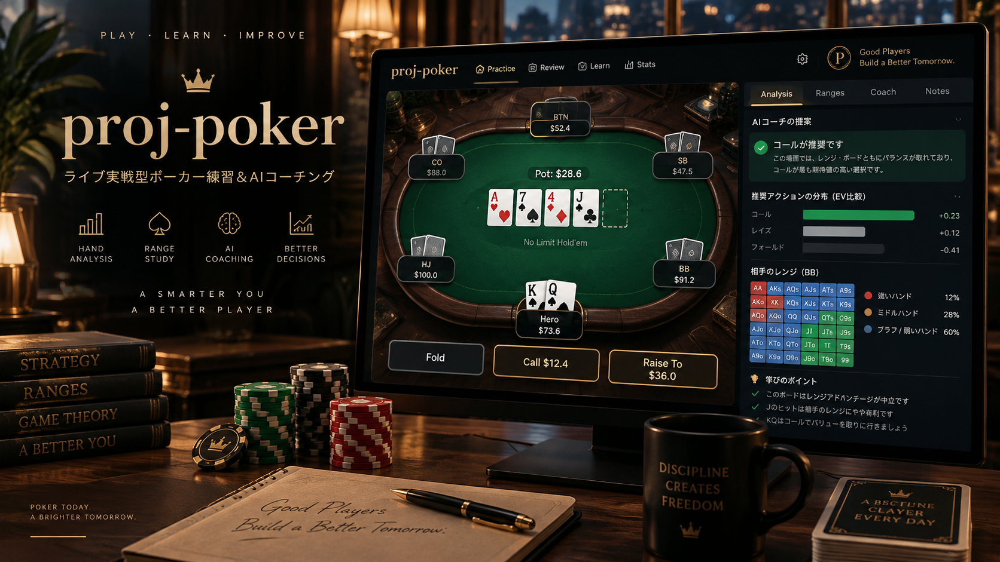

# proj-poker



*完成イメージ（実装済みの画面ではありません）。*

**ライブ実戦を意識した No-Limit Texas Hold'em（NLHE）の練習・AIコーチング環境**です。ローカルの単一ユーザー向けで、ブラウザで CPU 相手に打ち、終わった Hand を判断時点の情報だけで振り返ります。

## 現在の状態

**Phase 8（Tournament）まで完了し、Post-MVP（Phase 6〜8）を含むロードマップの全 Phase を終えています**（[`docs/08`](./docs/08_MVP_AND_ROADMAP.md) のロードマップは Phase 8 まで）。各 Phase の Parent Issue（MVP の [#2](https://github.com/takumi-sano22/proj-poker/issues/2)、Post-MVP の [#104](https://github.com/takumi-sano22/proj-poker/issues/104) と [#105](https://github.com/takumi-sano22/proj-poker/issues/105)〜[#107](https://github.com/takumi-sano22/proj-poker/issues/107)）は Close 済みです。Phase 8 の後に、Review の数値の照合（D131）や Tournament の実モデルでの録画（D132）などの横断の整理を行いました。

いまできること:

- 2〜8 人（既定 6-max）の NLHE Cash を CPU 相手に Session として続けて遊ぶ。6-max の STT（Tournament）も遊べる
- 実際の Chip の額面を Click / Drag で出す操作と宣言で Bet し、Dealer が TDA 準拠で裁定する
- 終わった Hand を Replay で一手ずつ見返し、Hand Review（判断時点の評価・Hand 後の答え合わせ・追加質問）を受ける
- Session の終わりに Session Review・Player Profile を見て、弱点の判断から作った Targeted Drill を練習する
- CPU は既定の RuleBot のほか、設定で Claude（Claude Code のログイン経由）に切り替えられる。CPU は Session を跨ぐ記憶・Tilt・卓の傾向を持つ
- サーバーを再起動しても、Hand の合間で止まった Session と学習の記録はそのまま続く

人間による実機の受け入れテスト（[#203](https://github.com/takumi-sano22/proj-poker/issues/203)）は、まだ終わっていません。Phase ごとの到達点は [Phase 履歴](./docs/phases/README.md) にあります。

## 誰のためのものか

基本ルールは分かるものの実戦経験が足りないプレイヤーが、**カジュアルな経験者と実戦で勝負できるレベル**の判断力を身につけることを目指します。練習の対象は、不完全情報での意思決定・Range / Equity / Pot Odds / EV・Value Bet と Bluff と Fold の判断・相手の傾向への調整・実卓での Chip 操作と宣言・結果論に引きずられない振り返りです（要件は [`docs/01`](./docs/01_PRODUCT_REQUIREMENTS.md)）。

## 主な機能

| 領域 | 内容 |
|---|---|
| Poker Engine | 決定論の Engine で Legal Action・Side Pot・Short All-in の Reopen・Showdown・Hand Ranking・Chip の移動を扱う |
| ライブの卓 | 実際の Chip の額面での操作と宣言・Ruling Engine（Oversized Chip・String Bet・Out of Turn）・Dealer Feedback・用語の表示 |
| AI の CPU | CPU ごとの KnowledgeState（見えない情報を渡さない）・6 種の Persona・出力の検証と Fallback・Fixed CPU の記憶・Tilt・卓の傾向 |
| Review | 判断時点の情報だけの Decision Review と、Hand 後の全員の札での答え合わせを分ける。Math・Range・Local KB・Solver（Heads-Up の Turn / River）を根拠に Claude が説明する |
| 学習 | Stats・Ability ごとの Score・弱点の仮説・Session Review・Targeted Drill・Learning Reset |
| Tournament | 6-max STT・Blind / Ante・Elimination・Payout・決定論の ICM・ICM を Chip EV と分けた Review |

使い方の詳細は [`docs/guides/USAGE_AND_LIMITATIONS.md`](./docs/guides/USAGE_AND_LIMITATIONS.md) にあります。

## 設計の原則

- **ルールは決定論、LLM は戦略の選択だけ**: 合法性・Pot・Chip の移動は Engine が決め、LLM には判断させない
- **CPU ごとに情報を分ける**: 各 CPU には自分の KnowledgeState だけを渡し、他者の札・未来のカード・学習用の開示・ユーザーの弱点を渡さない
- **Review に結果論を混ぜない**: Decision Review は判断時点の情報だけを使い、全員の札の開示は別の Pass にする
- **AI の文章より先に根拠を構造化する**: Math・Range・Solver・KB を Evidence にしてから Review AI に説明させる
- **Event Log が正本**: Stats・Profile などは Event Log から作り直す Projection。実額を常に表示し、BB は補助

詳しくは [`docs/00`](./docs/00_DOCUMENTATION_INDEX.md) §5 と [`docs/02`](./docs/02_DOMAIN_RULES_AND_POLICIES.md) を参照してください。

## 主な制約

- ローカルの単一ユーザー専用です（認証・オンライン対戦・リアルマネーは作りません）
- Claude は Claude Code のログイン（サブスク枠。API キーは使わない）で呼び、利用枠は開発用の Claude Code と共有です。CPU の 1 手に数秒〜十数秒、Review に十数秒〜数十秒かかります
- Solver は任意で、扱えるのは Heads-Up の Turn / River だけです。それ以外は Math・Range・KB で Review します
- Tournament は 1 卓の STT だけです。Hand の途中でサーバーを止めると、その Hand は保存されません
- Ruling・Persona・Score・Tournament などの多くの値は暫定値（[Open Items](./docs/11_OPEN_ITEMS.md)）で、永久仕様ではありません

すべての制約と暫定値は [`USAGE_AND_LIMITATIONS.md`](./docs/guides/USAGE_AND_LIMITATIONS.md) §2 にあります。

## 最短の起動手順

前提: Node 24（`.nvmrc`）。

```bash
corepack enable          # package.json の packageManager に書いた版の pnpm を使う
pnpm install
pnpm dev                 # apps/server（127.0.0.1:3001）と apps/web（Vite）を同時に起動
```

ブラウザで Vite が表示する URL（既定は `http://127.0.0.1:5173`）を開き、「Hand を始める」を押すと遊べます。既定の CPU は RuleBot なので、Claude と Solver が無くても遊べます（Hand Review には Claude のログインが必要です）。

環境変数・Claude の認証・Solver の導入・開発コマンド・E2E は [`docs/guides/SETUP_AND_DEVELOPMENT.md`](./docs/guides/SETUP_AND_DEVELOPMENT.md) にあります。

## ドキュメント

| 知りたいこと | 読む文書 |
|---|---|
| 文書の全体像・優先順位・読む順番 | [ドキュメント索引](./docs/00_DOCUMENTATION_INDEX.md) |
| セットアップ・環境変数・Claude・Solver・開発コマンド・E2E | [セットアップと開発ガイド](./docs/guides/SETUP_AND_DEVELOPMENT.md) |
| 画面の使い方・現在の制約と暫定値 | [使い方と現在の制約](./docs/guides/USAGE_AND_LIMITATIONS.md) |
| 仕様（要件・ドメイン・アーキテクチャ・データ・AI・UI・学習・テスト） | [`docs/01`〜`09`](./docs/00_DOCUMENTATION_INDEX.md)（索引 §4） |
| Phase 0〜8 の到達点と経緯 | [Phase 履歴](./docs/phases/README.md) |
| 採用済みの人間判断（D01〜D134） | [`decision_log.yaml`](./docs/decision_log.yaml)・[トレーサビリティ](./docs/10_DECISION_TRACEABILITY.md) |
| 未確定の事項 | [Open Items](./docs/11_OPEN_ITEMS.md) |
| Issue ごとの作業記録 | [`docs/taskLog/`](./docs/taskLog/) |
| ポーカードメインの調査 | [Research Pack](./docs/research/README.md) |

## 技術構成

pnpm workspace の `packages/engine`（純粋 TypeScript の Poker Engine）・`apps/server`（`127.0.0.1` で待ち受ける Fastify の Local Runtime。Claude と SQLite はここだけが扱う）・`apps/web`（Vite + React の SPA）・`e2e`（Playwright）。Node 24・`node:sqlite`・Claude Agent SDK・ローカルの Solver（amaster97/poker_solver）を使います。モデル名と Solver は Domain Logic に書かず、Config と Adapter で差し替えます。詳細は [`docs/03`](./docs/03_SYSTEM_ARCHITECTURE.md) にあります。

## 開発の進め方

AI 駆動で開発していますが、設計判断は AI に丸投げしません。人間の判断を Decision Log に固定し、ドメインは Research Pack で調べ、未確定の事項は Open Items に隔離し、決定論のテストを実行可能な仕様として使います。開発のルールは [`CLAUDE.md`](./CLAUDE.md) と `.claude/`（Skills / Harness。目次は [`.claude/README.md`](./.claude/README.md)）にあります。

人間向けの文章は原則として日本語で書きます（コード識別子・API 名・型名・ライブラリ名・一般的なポーカー用語などは英語のまま。規約は [`docs/00`](./docs/00_DOCUMENTATION_INDEX.md) §2）。
